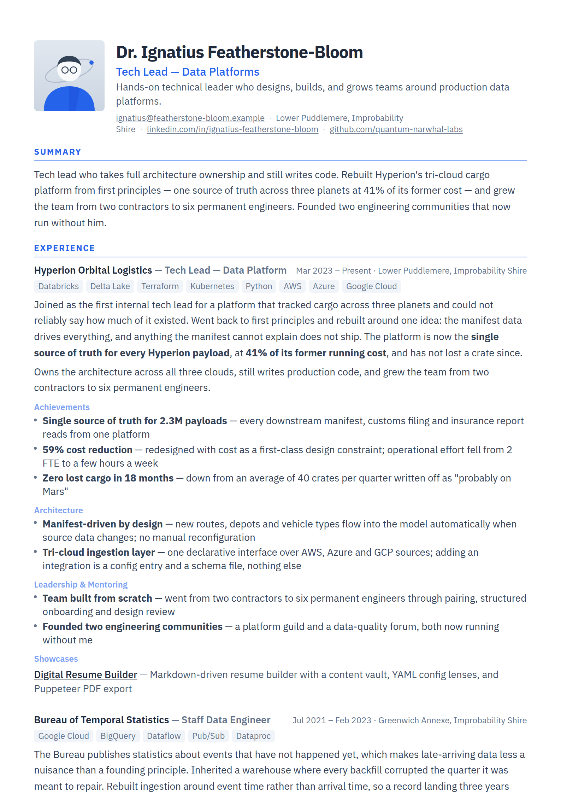

# Agentic Resume Builder

[](https://github.com/WtotdeD/agentic-resume-builder/actions/workflows/ci.yml)
[](LICENSE)

A resume builder where your career is markdown and each resume is a view over it.

Write a job once. Then define as many resumes as you have audiences — a tech lead
version, an AWS version, a startup version — each selecting different entries and
different sections from the same content. Render any of them in the browser or
export an A4 PDF.

<p align="center">
  
</p>

> **The profile in this repo is fictional.** Dr. Ignatius Featherstone-Bloom does
> not exist, has not been to Mars, and the narwhals are not real. It is demo data
> so the app has something to render. Replace `content/` with your own.

## Which are you here for?

**I want my own resume.** Fork the repo, run it, and replace `content/` with your
career. You never need to open a pull request or read anything below
[Adding content](#adding-content). Start at [Quickstart](#quickstart).

**I want to work on the engine.** Read [`ARCHITECTURE.md`](ARCHITECTURE.md) for
how the pieces fit and [`CONTRIBUTING.md`](CONTRIBUTING.md) for setup and the
pull request rules. The one thing worth knowing up front is that a lens
references content by exact string, and one of those two references fails
silently.

## How it works

```
content/                  resumes/                   output
─────────                 ────────                   ──────
settings.yaml             tech-lead.yaml         ->  /render/tech-lead      -> PDF
experience/*.md    ->     aws-data-engineer.yaml ->  /render/aws-data-...   -> PDF
skills.md                 azure-data-engineer... ->  /render/azure-data-... -> PDF
education.md              gcp-data-engineer.yaml
certifications.md         startup-entrepreneu...
showcases.md
projects.md
```

**`content/` is the vault** — everything you have ever done, written once, in
markdown with YAML frontmatter.

**`resumes/*.yaml` are lenses** — each names which experience entries to expand,
which sections of those entries to show, and which showcases to include. Nothing
is duplicated between them.

Both are read from disk on every request, so editing a file and reloading the
page is the whole feedback loop.

## Quickstart

```bash
./install.sh
```

Checks the repo, installs Docker if it is missing, builds the image, starts the
container, and smoke-tests the PDF export before printing the URLs. Then open
<http://localhost:3000>.

Without Docker:

```bash
pnpm install
pnpm dev
```

Rendering a PDF needs Chromium; the Docker path provides it.

## Adding a resume

Copy any file in `resumes/` and edit it:

```yaml
title: Data Engineer — AWS
tagline: One line under your name.

summary: |
  Two or three sentences. This is the top of the page.

experience:
  expand: # entry ids rendered in full
    - kraken-senior-data-engineer
    - hyperion-tech-lead
  sections: # which ## headings to show, matched exactly
    - Achievements
    - Architecture
    - Cost & Efficiency

showcases:
  - krakenctl

certifications: all

sectionOrder:
  - summary
  - experience
  - certifications
  - education

style:
  accent: '#ff9900'
```

Entries not listed in `expand:` still appear, rendered compactly as a title, dates
and narrative. That is how a twelve-year career fits on two pages.

**The two references behave differently when they are wrong.** An `expand:` id
that matches no entry throws, and the page shows a visible render error. A
`sections:` name that does not exactly match a `##` heading fails **silently** —
the section simply does not appear, with no error anywhere. That second one is the
trap: after editing, open the page and check the section is really there.
[`ARCHITECTURE.md`](ARCHITECTURE.md) documents the heading vocabulary and why it
works this way.

## Adding content

An agent skill ships in `.claude/skills/content-interview/`. Ask Claude Code to
interview you about a role and it writes a correctly formatted entry into
`content/experience/`. Or copy an existing file — the format is plain markdown
with frontmatter.

## Commands

| Command         | What it does                      |
| --------------- | --------------------------------- |
| `pnpm dev`      | Development server                |
| `pnpm validate` | Lint, format check, tests, build  |
| `pnpm test`     | Unit and integration tests        |
| `./install.sh`  | Docker build, run, and smoke test |

`docs/docker.md` covers the container setup, ports, and troubleshooting.

## Stack

Next.js 14 (App Router), TypeScript in strict mode, Zod for content validation,
Tailwind, Puppeteer for PDF export. Self-hosted fonts, no external requests at
render time.

## Contributing

Bug reports, fixes and small features are welcome — see
[`CONTRIBUTING.md`](CONTRIBUTING.md) and [`CODE_STANDARDS.md`](CODE_STANDARDS.md).

## Licence

MIT — see [`LICENSE`](LICENSE).
